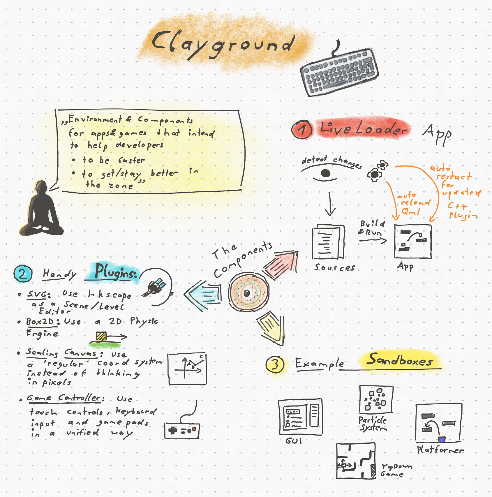
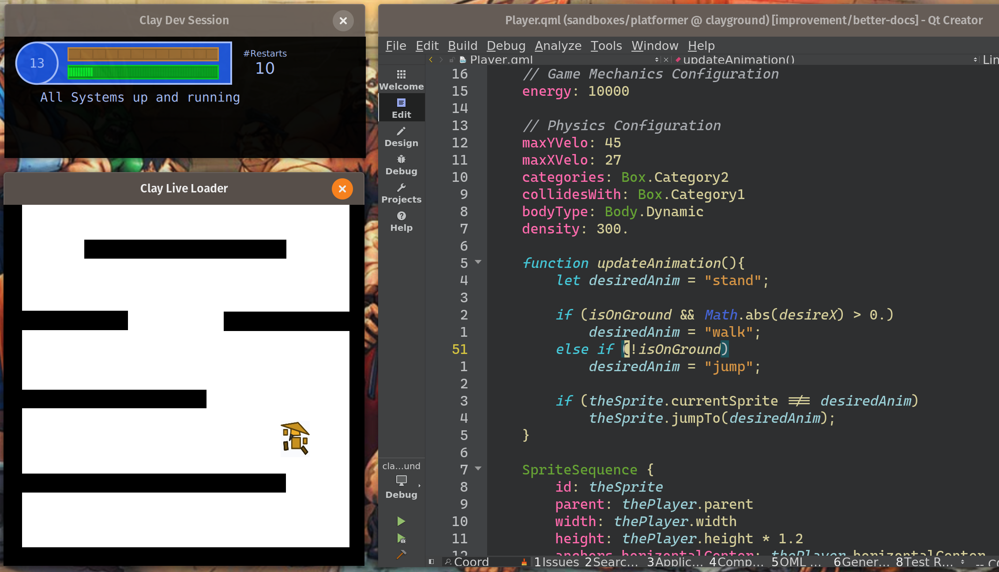

## Flow, form, create 
When participating at [Ludum Dare 44](https://ldjam.com) I started to develop
utilities and a LiveLoading app to ease game creation. As I really enjoyed
using these components, I decided to create separate project and make it
open source.

Clayground is a Qt based environment that allows using C++, JavaScript
and QML to rapidly develop apps in a sandbox environment with live loading.
It provides tools that try both facilitating learning and allowing more
focused and faster development by reducing typical build and restart times
significantly.

### Available Plugins
Clayground comes with a set of plugins that extend Qt capabilities in order to
build interactive experiences:
- Physics/Box2D: Adds 2D Physics capabilities
- Canvas: A canvas component that provides a 2D virtual/world coordinate
  system tries to hide dealing with pixels as much as possible.
- SVG Utils: Allows inspection of (Inkscape based) SVGs, can be used to create 2d scenes
- GameController: Supports game input using three different sources GamePad, Keyboard and Touch Screen with single component.
- Storage: Get persistent storage with a very simple API
- World: Uses Canvas, Physics and SVG to provide a foundation for small games and simultations

### Available Examples
A bunch of example application allow you to try it out easily:
- GUI: Very simple example showing Quick Controls and the Storage plugin in action.
- VisualFX: Implementation of different visual effects, includes usage of the [Qt Particle System](https://doc.qt.io/qt-5/qtquick-effects-particles.html).
- Platformer: Starting point for a platformer game.
- TopDown: Starting point for a topdown game (for example a classical RPG).
- PluginLive: Demonstrates how to use the Clayground LiveLoader to develop a C++ plugin.

### How to work with a sandbox?
1. Clone this repo and build it (Qt 5.14.x, Qt Creator)
2. Start the qml_live_loader app `qml_live_loader --dynimportdir=<clone-dir>/sandboxes/gui`
3. Move the window to a location that allows you to keep it visible even when your are editing code.
4. Make changes to `<clone-dir>/sandboxes/gui/Sandbox.qml` -> see the changes live applied
5. Check out the other sandboxes in the same way :)
